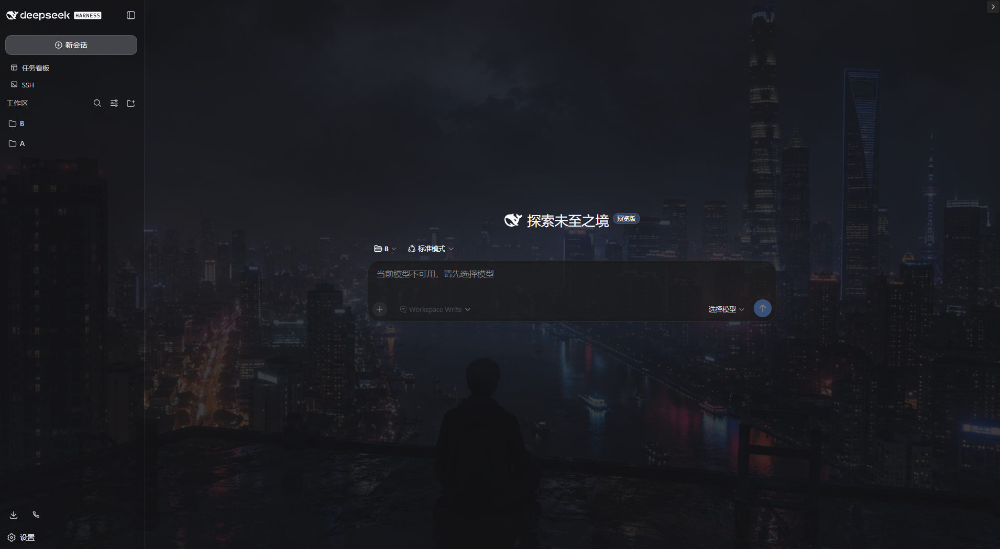
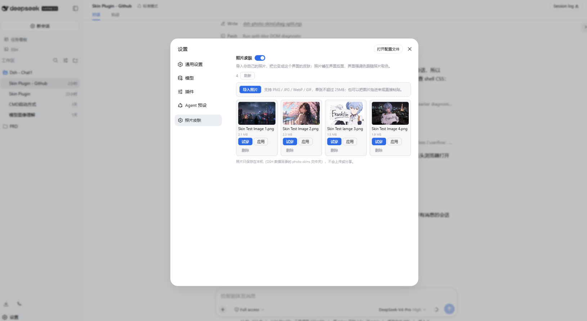
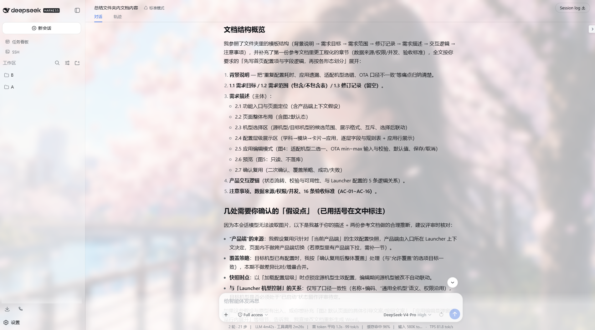

# 🪄 dsh-photo-skins

[中文](README.zh.md) | English

Import once. Auto-accent once. Turn any photo into a skin for the DSH Web GUI.


Photo skins for the DSH Web GUI: import your own photos and turn them into
the interface skin. The photo paints the backdrop behind the GUI, and the
accent colors are extracted from the photo automatically (dominant color as
the accent, photo-tinted light/dark readability veils). Rendering controls:
fit (cover/contain), blur (0-100px, global or split empty/content), dim
(0-100%) and the auto-accent toggle.

A standalone cordis plugin: settings card + host routes + settings namespace +
client layer controller.

## ✨ Core Feature

### 📥 Import photos three ways

- File picker, drag-and-drop, or paste — pick whichever you like
- Supports PNG / JPG / WebP / GIF, up to 25MB each

### 👗 Try on / apply / remove
- Manage everything from the first-level "Photo skins" settings section
- "Try on" previews temporarily without touching the applied photo
- "Apply" writes the skin in one click; "Remove" clears the local copy

### 🎨 Automatic accent extraction
- The photo's dominant color becomes the interface accent
- Derives light/dark scrim tints so the readability veils pick up the photo's own tone
- Exposes CSS variables `--dsw-photo-accent` / `--dsw-photo-accent-soft` / `--dsw-photo-accent-contrast`

### 🖼️ Rendering controls

- Fit: cover / contain
- Blur: 0–100px, global or split
- Dim: 0–100%, keeping foreground content readable
- Accent-from-photo: toggle on/off anytime

### 💾 Local persistence
- The applied photo persists through the `photo-skins` settings namespace and survives reloads
- Files stay on this machine — nothing is uploaded or shared
  
## 🚀 Install

From npm:

```sh
dsh plugin --profile web add dsh-photo-skins
```

From this repository (development):

```sh
pnpm install && pnpm build
dsh plugin --profile web add link:.
```

Then refresh the running Web GUI (restart `dsh web` if the new section does
not appear).

## Storage

Photos are stored under `<DSH_HOME>/photo-skins/<id>/` (`original.<ext>` plus
a `manifest.json` with the display name, type, size and import time). Nothing
is uploaded or shared; removal deletes the local copy.

## 🔒 Security model

- All routes (`/api/photo-skins/*`) sit behind a same-origin fence
  (Sec-Fetch-Site / Origin): cross-site webpages cannot read, import or
  delete your photos.
- Uploads are validated by file magic bytes, not by name or declared
  content-type — a renamed SVG or executable is rejected (415). SVG is
  deliberately unsupported (script risk).
- Uploads are capped at 25MB (413) and written atomically (tmp + rename).
- Stored ids are generated and validated against a whitelist regex, so no
  path can escape the store directory.


## 🛠️ Development
Requirements: Node.js ^22.19 || >=24, pnpm

```sh
pnpm install
pnpm typecheck   # tsc --noEmit
pnpm test        # vitest run
pnpm build       # tsdown -> lib/ (host) + lib/client.js (browser bundle)
```

## License

BSD-3-Clause. See THIRD_PARTY_NOTICES.md for attribution of incorporated
portions.
